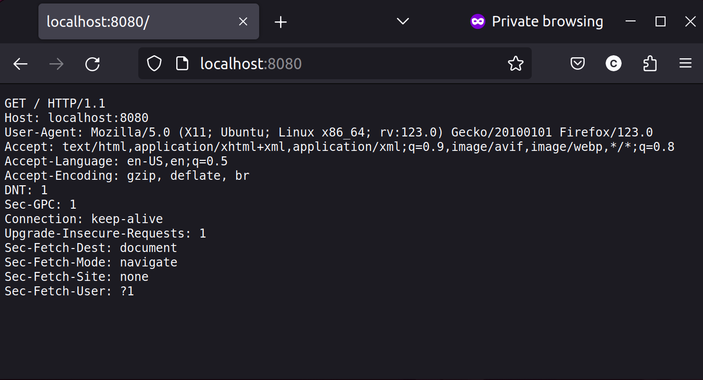

# rust-echo-server
An echo server written in Rust with simple Docker deployment. Done as a first step towards implementing a full fledged HTTP compliant web server in Rust.  
## Usage
This server simply listens on port 8080 for any incoming connections and serves back all of the bytes sent by the client. For example, accessing the server through a web browser will send back the HTTP reqeust sent by the browser, like below.  


## Deploying the server locally with Docker  
1. Clone the repo
    ```
    git clone https://github.com/calebkbrad/rust-echo-server.git
    ```
2. Build the Docker image
   ```
   docker build -t echo_server .
   ```
3. Run the Docker container
   ```
   docker run -p 8080:8080 --rm --name server echo_server
   ```

